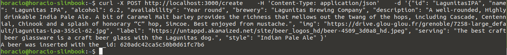
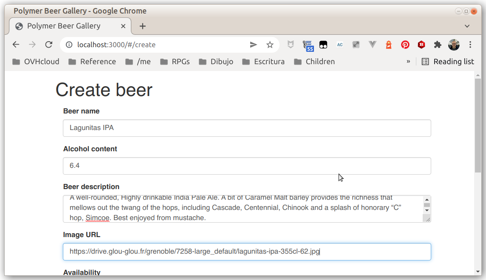

# ExpressJS - Step 06 - Adding a new beer

Now we can add methods to create, edit and delete beers, so we have a complete [CRUD](https://en.wikipedia.org/wiki/Create,_read,_update_and_delete) application. Let's begin with beer creation...

> In this step we are using POST endpoints to add beers. To test the application, you will need to create and send POST requests. You can do it in command line with `curl` or using a GUI like [Insomnia REST](https://insomnia.rest/)


## Creating new beers


As we are following [REST conventions](https://en.wikipedia.org/wiki/Representational_state_transfer), we are adding a new POST route at `/create`, that wil receive the new beer data as a JSON object in the body of the request.

As in the precedent examples, we are using [async/await](https://developer.mozilla.org/en-US/docs/Web/JavaScript/Reference/Statements/async_function) to make asynchronous code simple.


## Using the `bodyParser` middelware

In order to read the request body, we need to add the `bodyParser` middelware to the Express application. 

First we need to install the `bodyParser` middelware package:

```shell
npm i body-parser
```

And then we need to instanciate and initialise it in our code:


```js
var bodyParser = require('body-parser');

[...]

app.use(bodyParser.json());
```

And then we can add the new route:


```js
app.post('/create', async function (req, res) {
  console.log('Received request to create a new beer from', req.ip);
  console.log('New beer', req.body);
  res.send('ok');
});
```

Now we can test if the endpoint is working as intended by sending a POST request to the endpoint:

```shell
curl -X POST http://localhost:3000/create \
   -H 'Content-Type: application/json' \
   -d '{"id": "LagunitasIPA", "name": "Lagunitas IPA", "alcohol": 6.2, "availability": "Year round", "brewery": "Lagunitas Brewing Company", "description": "A well-rounded, Highly drinkable India Pale Ale. A bit of Caramel Malt barley provides the richness that mellows out the twang of the hops, including Cascade, Centennial, Chinook and a splash of honorary “C” hop, Simcoe. Best enjoyed from mustache.", "img": "https://drive.glou-glou.fr/grenoble/7258-large_default/lagunitas-ipa-355cl-62.jpg", "label": "https://untappd.akamaized.net/site/beer_logos_hd/beer-4509_3d0a8_hd.jpeg", "serving": "The best craft beer glassware is a craft beer glass with the Lagunitas dog.", "style": "Indian Pale Ale" }'
```

## Verifying we got a beer

We are working in a *create* request, we're inserting data into the database, a potentially dangerous behaviour. Before inserting the data, we need to verify that is indeed a beer.

Let's create a `isBeer()` function that verifies if an object is a valid beer or not:

```js
function isBeer(obj) {
  // If the minimal information on the beer isn't available, the object isn't a valid beer
  if (
    !obj.hasOwnProperty('id') || 
    !obj.hasOwnProperty('name') || 
    !obj.hasOwnProperty('alcohol') || 
    !obj.hasOwnProperty('description') 
  ) {
    return false;
  }
  return true;
}
```

Now we can test if the received object is a valid beer, and send back a *bad request* message if it isn't:

```js
app.post('/create', async function (req, res) {
  console.log('Received request to create a new beer from', req.ip);
  console.log('New beer', req.body);
  if (!isBeer(req.body)) {
    res.status(400);
    res.send(`Received object isn't a valid beer: ${JSON.stringify(req.body)}`);
    return;
  }
  res.send('ok');
});
```


## Writing the beer in the database

The last step is to write the beer in the database. Before writing it, we want to *sanitize* it, i.e. keeping only the fields defining a beer object. 


To to that, we write a `sanitizeBeer()` function:

```js
function sanitizeBeer(beer) {
  return { 
    id: beer.id, name: beer.name, alcohol: beer.alcohol, description: beer.description, 
    availability: beer.availability, brewery: beer.brewery, img: beer.img, label: beer.label,
    serving: beer.serving, style: beer.style
   };
}
```

And we use before writing data into the database. We also need to verify that a beer with id `beer.id` doesn't exist yet in the database, to avoid creating a duplicate beer.

```js
app.post('/create', async function (req, res) {
  console.log('Received request to create a new beer from', req.ip);
  console.log('New beer', req.body);
  if (!isBeer(req.body)) {
    res.status(400);
    res.send(`Received object isn't a valid beer: ${JSON.stringify(req.body)}`);
    return;
  }
  let beer = sanitizeBeer(req.body);
  let client;
  try {  
    client = await MongoClient.connect(url);
    const db = client.db(dbName);

    let exists = await db.collection('beers').find({id: beer.id}).count();
    if (exists > 0) {
      res.status(401);
      res.send(`There is already a beer with id ${beer.id} in the database \n`)
      return;
    }
    let result = await db.collection('beers').insertOne(beer);
    res.send(`A beer was inserted with the _id: ${result.insertedId} \n`);
  } catch(err) {
    console.log(err.stack);
  }
  client.close();
});
```




## Refactoring

So now we have three endpoints that connect to the database:

- `GET /beers`
- `GET /beer/{id}`
- `POST /create`

And we write the same code to open a connection to the database, do our operation and then close the connection. It isn't only a bad coding practice, it is a very inefficient way of doing things, and it will make our application difficult to scale up.

Let's refactor it by opening the database connection before the creation of the server:


```js
var express = require('express');
var app = express();
var assert = require('assert');
var MongoClient = require('mongodb').MongoClient;
var bodyParser = require('body-parser');

async function connect() {
  try {  
    let client = await MongoClient.connect(url);
    db = client.db(dbName);
  } catch(err) {
    console.log(err.stack);
  }
}

[...]

app.get('/beers', async function (req, res) {
  console.log('Received request for beers from', req.ip);
  try {  
    var beerList = await db.collection('beers').find().toArray();
    res.json(beerList);
  } catch(err) {
    console.log(err.stack);
  }
});

app.get('/beer/:beerId', async function (req, res) {
  console.log(`Received request for ${req.params.beerId} from ${req.ip}`);
  try {  
    let beerId = req.params.beerId;
    let beerList = await db.collection('beers').find({id: beerId}).toArray(); 
    let beer = beerList[0];
    console.log(beer);
    res.json(beer);
  } catch(err) {
    console.log(err.stack);
  }
});

app.post('/create', async function (req, res) {
  console.log('Received request to create a new beer from', req.ip);
  console.log('New beer', req.body);
  if (!isBeer(req.body)) {
    res.status(400);
    res.send(`Received object isn't a valid beer: ${JSON.stringify(req.body)}`);
    return;
  }
  let beer = sanitizeBeer(req.body);
  try {      
    let exists = await db.collection('beers').find({id: beer.id}).count();
    if (exists > 0) {
      res.status(401);
      res.send(`There is already a beer with id ${beer.id} in the database \n`)
      return;
    }
    let result = await db.collection('beers').insertOne(beer);
    res.send(`A beer was inserted with the _id: ${result.insertedId} \n`);
  } catch(err) {
    console.log(err.stack);
  }
});

[...]

var db;
connect();

var server = app.listen(3000, function () {
  var host = server.address().address;
  var port = server.address().port;
  console.log('Listening at http://%s:%s', host, port);
});
```

## Testing with the sample frontend

In the `/complete-sample-frontend` folder there is a Polymer based frontend that including all CRUD operations. You can copy it into the `public` forder of your project, and you will be able to use it to test that your backend is working as intended.



