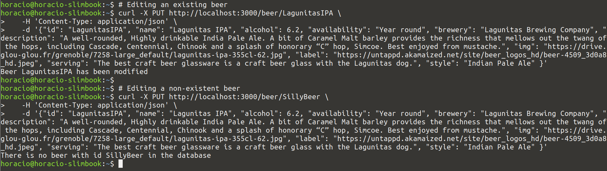
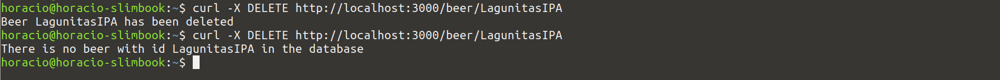

# ExpressJS - Step 07 - Editing and deleting beers

After having added the creation route, we need to add edit and delete to have a complete [CRUD](https://en.wikipedia.org/wiki/Create,_read,_update_and_delete) application. Let's begin with beer editing...


## Editing a beer

As we are following [REST conventions](https://en.wikipedia.org/wiki/Representational_state_transfer), we are adding a new PUT route at `/beer/:beerId`, that will receive the modified beer data as a JSON object in the body of the request.

As in the precedent examples, we are using [async/await](https://developer.mozilla.org/en-US/docs/Web/JavaScript/Reference/Statements/async_function) to make asynchronous code simple. We are also using the `bodyParser` middelware that we used in the precedent step.

Let's add the route:

```js
app.put('/beer/:beerId', async function (req, res) {
  console.log(`Received request for editing ${req.params.beerId} from ${req.ip}`);
  console.log('Beer to edit', req.body);
  res.send('ok');
});
```

Now we can test if the endpoint is working as intended by sending a PUT request to the endpoint:

```shell
curl -X PUT http://localhost:3000/beer/LagunitasIPA \
   -H 'Content-Type: application/json' \
   -d '{"id": "LagunitasIPA", "name": "Lagunitas IPA", "alcohol": 6.2, "availability": "Year round", "brewery": "Lagunitas Brewing Company", "description": "A well-rounded, Highly drinkable India Pale Ale. A bit of Caramel Malt barley provides the richness that mellows out the twang of the hops, including Cascade, Centennial, Chinook and a splash of honorary “C” hop, Simcoe. Best enjoyed from mustache.", "img": "https://drive.glou-glou.fr/grenoble/7258-large_default/lagunitas-ipa-355cl-62.jpg", "label": "https://untappd.akamaized.net/site/beer_logos_hd/beer-4509_3d0a8_hd.jpeg", "serving": "The best craft beer glassware is a craft beer glass with the Lagunitas dog.", "style": "Indian Pale Ale" }'
```

As precedently, we need to verify that the received object is a valid beer, and send back a *bad request* message if it isn't:

```js
app.put('/beer/:beerId', async function (req, res) {
  console.log(`Received request for editing ${req.params.beerId} from ${req.ip}`);
  console.log('Beer to edit', req.body);
  if (!isBeer(req.body)) {
    res.status(400);
    res.send(`Received object isn't a valid beer: ${JSON.stringify(req.body)}`);
    return;
  }
  res.send('ok');
});
```

We also need to be sure that the beer `id` remains unchanged, so we overwrite it with the route parameter. And then, as precedently, we *sanitize* it to eliminate the eventual fields not belonging to a beer object.

```js
app.put('/beer/:beerId', async function (req, res) {
  console.log(`Received request for editing ${req.params.beerId} from ${req.ip}`);
  let beer = req.body;
  console.log('Beer to edit', beer);
  if (!isBeer(beer)) {
    res.status(400);
    res.send(`Received object isn't a valid beer: ${JSON.stringify(beer)}`);
    return;
  }
  beer.id = req.params.beerId;
  beer = sanitizeBeer(beer);
  res.send('ok');
});
```

We can now verify if the beer exists, and if it does, we replace the beer into the database.


```js
app.put('/beer/:beerId', async function (req, res) {
  console.log(`Received request for editing ${req.params.beerId} from ${req.ip}`);
  let beer = req.body;
  console.log('Beer to edit', beer);
  if (!isBeer(beer)) {
    res.status(400);
    res.send(`Received object isn't a valid beer: ${JSON.stringify(beer)}`);
    return;
  }
  beer.id = req.params.beerId;
  beer = sanitizeBeer(beer);

  try {  
    let exists = await db.collection('beers').find({id: beer.id}).count();
    if (exists == 0) {
      res.status(401);
      res.send(`There is no beer with id ${beer.id} in the database \n`)
      return;
    }
    let result = await db.collection('beers').replaceOne({id: beer.id}, beer);
    res.send(`Beer ${beer.id} has been modified \n`);
  } catch(err) {
    console.log(err.stack);
  }
});
```

Now we can test everything is working as intended by sending several PUT request to the endpoint, a correct one (editing an existing beer) and a bad one (with an non existing beer):


```shell
# Editing an existing beer
curl -X PUT http://localhost:3000/beer/LagunitasIPA \
   -H 'Content-Type: application/json' \
   -d '{"id": "LagunitasIPA", "name": "Lagunitas IPA", "alcohol": 6.2, "availability": "Year round", "brewery": "Lagunitas Brewing Company", "description": "A well-rounded, Highly drinkable India Pale Ale. A bit of Caramel Malt barley provides the richness that mellows out the twang of the hops, including Cascade, Centennial, Chinook and a splash of honorary “C” hop, Simcoe. Best enjoyed from mustache.", "img": "https://drive.glou-glou.fr/grenoble/7258-large_default/lagunitas-ipa-355cl-62.jpg", "label": "https://untappd.akamaized.net/site/beer_logos_hd/beer-4509_3d0a8_hd.jpeg", "serving": "The best craft beer glassware is a craft beer glass with the Lagunitas dog.", "style": "Indian Pale Ale" }'

# Editing a non-existent beer
curl -X PUT http://localhost:3000/beer/SillyBeer \
   -H 'Content-Type: application/json' \
   -d '{"id": "LagunitasIPA", "name": "Lagunitas IPA", "alcohol": 6.2, "availability": "Year round", "brewery": "Lagunitas Brewing Company", "description": "A well-rounded, Highly drinkable India Pale Ale. A bit of Caramel Malt barley provides the richness that mellows out the twang of the hops, including Cascade, Centennial, Chinook and a splash of honorary “C” hop, Simcoe. Best enjoyed from mustache.", "img": "https://drive.glou-glou.fr/grenoble/7258-large_default/lagunitas-ipa-355cl-62.jpg", "label": "https://untappd.akamaized.net/site/beer_logos_hd/beer-4509_3d0a8_hd.jpeg", "serving": "The best craft beer glassware is a craft beer glass with the Lagunitas dog.", "style": "Indian Pale Ale" }'   
```




Of course, like in the precedent step, you can test with the sample frontend from `/complete-sample-frontend` that you have copied into the `public` forder in the precedent folder.


## Delete a beer

Once again, following [REST conventions](https://en.wikipedia.org/wiki/Representational_state_transfer), we are adding a new DELETE route at `/beer/:beerId`, that will command the deleting of the beer in the database.

Let's add the route:

```js
app.delete('/beer/:beerId', async function (req, res) {
  console.log(`Received request for deleting ${req.params.beerId} from ${req.ip}`);
  res.send('ok');
});
```

We verify if the beer exists in the database, and if it does, we delete it:

```js
app.delete('/beer/:beerId', async function (req, res) {
  console.log(`Received request for deleting ${req.params.beerId} from ${req.ip}`);
  try {  
    let exists = await db.collection('beers').find({id: req.params.beerId}).count();
    if (exists == 0) {
      res.status(401);
      res.send(`There is no beer with id ${req.params.beerId} in the database \n`)
      return;
    }
    let result = await db.collection('beers').deleteOne({id: req.params.beerId});
    res.send(`Beer ${req.params.beerId} has been deleted \n`);
  } catch(err) {
    console.log(err.stack);
  }
});
```


Now we can test everything is working as intended by sending several DELETE requests for the same beer to the endpoint, the first one will delete the beer, the rest will get an error:


```shell
curl -X DELETE http://localhost:3000/beer/LagunitasIPA
curl -X DELETE http://localhost:3000/beer/LagunitasIPA
```



Of course, like in the precedent step, you can test with the sample frontend from `/complete-sample-frontend` that you have copied into the `public` forder in the precedent folder.